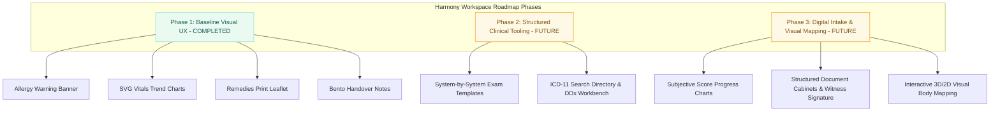

# Harmony Health MIS - System Documentation

> Updated: 2026-06-06  
> Product: Harmony Health MIS  
> Organization: Harmony Health and Wellness  
> Source repository: `Ayandadlamini12/Harmony-System-Django`

This document is the current technical and workflow reference for the Harmony Health MIS. It reflects the Django REST API, Next.js frontend, Keycloak identity rollout, patient workflow work, document/consent work, support modules, and deployment changes that have been added after the original Laravel + Vue + Inertia prototype was replaced.

---

## 1. System Purpose

Harmony Health MIS is a clinic operating system for a homeopathic practice. It is being built to manage:

- patient registration and identity records
- consent form generation, signing, and patient document storage
- check-in, queue, appointment check-in, and patient process tracking
- medical/family history and confidential clinical records
- vitals, visits, follow-ups, symptoms/problems, remedies, and recommendations
- role-aware dashboards for admin, clinicians, and reception
- employee onboarding and account administration
- support tickets, deleted-patient recovery, internal messages, and future external workflow integrations

The system must protect confidential clinical information while still allowing reception staff to perform non-clinical intake and front-desk workflows.

---

## 2. Current Stack

### Backend

| Area | Technology |
| --- | --- |
| Framework | Django 5.2 |
| API | Django REST Framework |
| Authentication | SimpleJWT locally, Keycloak integration for production identity |
| Database | PostgreSQL in production, SQLite available for local dev fallback |
| Async / queue | Redis + Celery + Celery Beat |
| Email | django-anymail with Brevo API support plus SMTP fallback settings |
| PDF / documents | WeasyPrint, ReportLab, Pillow, qrcode |
| Web server | Gunicorn |

### Frontend

| Area | Technology |
| --- | --- |
| Framework | Next.js 15 App Router |
| UI | React 19 + TypeScript |
| Styling | Tailwind CSS 4, shared Harmony CSS tokens, Radix UI primitives |
| Forms | React Hook Form, Zod, custom staged form components |
| Icons | lucide-react |
| Tables | shared `.hh-compact-table` style and local table components |
| Signing | `signature_pad` for handwritten signature capture |

### Infrastructure

| Area | Technology |
| --- | --- |
| Runtime | Docker containers |
| Control panel | Portainer |
| Public access | Cloudflare Tunnel |
| Server constraints | Existing CyberPanel and PHP sites must not be disturbed |
| Current live URL | `https://mis.harmonyhealthsz.com` |
| Identity URL | `https://auth.harmonyhealthsz.com` |

---

## 3. Current Deployment State

The production deployment has evolved from a normal compose build into a mixed faster deployment model.

Observed current live behavior:

- backend, celery, and beat may run from GHCR images
- frontend may be rebuilt and hot-swapped locally as a server image
- Portainer stack 69 can still contain an older compose definition
- the running frontend container may not perfectly match the stack editor definition

Important rule:

Do not blindly click Portainer "Redeploy stack" or run a full stack recreation unless the stack definition is verified first. It may replace the optimized running containers with stale compose behavior.

Recommended safe deployment approach:

1. Commit and push source changes to GitHub.
2. For backend changes, build/publish backend image or update the server source and run migrations deliberately.
3. For frontend-only changes, use the faster targeted frontend rebuild/swap method if it is still the active production method.
4. Restart only the affected containers.
5. Verify `/api/health`, login, and the changed page.
6. Keep Portainer as visibility and emergency control, not as a place for manual source editing.

Long-term recommendation:

- GitHub should remain the source of truth.
- Production should move toward prebuilt image tags and repeatable deploy scripts.
- Portainer stack definitions should be reconciled with the running containers to remove drift.

---

## 4. Repository Structure

```text
Harmony-System-Django/
  backend/
    accounts/                  User, roles, Keycloak helpers, email settings
    clinic/                    Patient, visit, consent, journey, messaging domain
    config/                    Django settings, URL routing, Celery
    manage.py
    requirements.txt
  frontend/
    src/app/                   Next.js App Router pages and API proxies
    src/components/            Shared UI, forms, patient workspace, shell
    src/lib/                   API helpers, session helpers, role workflow maps
    src/types/                 TypeScript domain types
    public/brand/              Harmony logo/favicon assets
  docs/                        Workflow, deployment, Keycloak, n8n, future roadmap
  deployment/                  Deployment helpers and related assets
  docker-compose.yml           Local development stack
  docker-compose.prod.yml      Production compose reference
  remote-deployment-stack.yml  Historical Portainer stack reference
```

The active local source-of-truth folder is:

```text
C:\Users\ayand\Local Library\Github\Harmony-System-Django
```

The older OneDrive-managed clone should not be treated as the active working repo.

---

## 5. Backend Domain Model

### Accounts

| Model | Purpose |
| --- | --- |
| `User` | Django user with Harmony role and optional profile image |
| `RoleModulePermission` | Enables/disables modules per role |
| `ClinicianProfile` | Clinician resume/profile completion tracking |
| `EmployeeEnrollmentRequest` | Pending employee onboarding requests from n8n/internal sources |
| `SystemEmailSettings` | Brevo API or SMTP settings managed in the app |
| `EmailDeliveryLog` | Audit/log table for transactional email delivery |

Supported user role categories:

- `admin`
- `clinician`
- `receptionist`
- `supplier_contact`
- `supplier_manager`
- `partner_contact`
- `partner_manager`

Current employee User ID rule:

- employees use the `HH200` range
- issued example IDs include `HH2005110`, `HH2005187`, `HH2005264`, `HH2005341`
- future ranges planned:
  - `HH100...` patients
  - `HH200...` employees
  - `HH300...` suppliers
  - `HH400...` external partners

### Clinic

| Model | Purpose |
| --- | --- |
| `Patient` | Master patient identity, contact, next of kin, consent status, soft-delete |
| `PatientProfile` | Medical/family history and sensitive summary fields |
| `PatientCondition` | Confidential condition flags with yes/no and notes |
| `PatientDocument` | Generated/uploaded patient documents, consent forms, signed files |
| `ElevatedAccessRequest` | Approval flow for protected clinical records |
| `PatientCheckIn` | Reception/tablet/API check-in records |
| `Appointment` | Booked appointment records and source tracking |
| `PatientJourney` | Daily process tracking for patient stage, queue/check-in status |
| `PatientJourneyEvent` | Stage history for patient journey tracking |
| `FormDraft` | Generic account-linked form draft/autosave storage |
| `Visit` | Consultation/follow-up clinical record |
| `VisitSymptomProblem` | Open/resolved symptom/problem list across visits |
| `Case` | Legacy/transition case model; future model may be adjusted |
| `Vital` | Vitals linked to a visit; supports multiple vitals per visit |
| `MessageThread`, `Message`, `MessageParticipant`, `MessageDelivery` | Internal messaging foundation and future external delivery channels |
| `AuditLog` | Create/update/delete/access traceability |
| `SupportTicket` | Internal support request tracking |

---

## 6. Patient Workflow

### New Patient

Current planned flow:

1. Registration
2. Consent form signing
3. Check-in / queue
4. Medical and family history
5. Confidential clinical records
6. Vitals
7. New visit / consultation

Important rules:

- consent signing is a blocker before vitals and clinical records
- check-in and consent do not need to happen in only one order
- a receptionist should not reach clinician-only clinical steps
- vitals must be linked to a visit and can be recorded more than once
- after a step is completed, the next eligible step should be opened automatically when possible

### Existing Patient

Current planned flow:

1. Check-in or appointment check-in
2. Review confidential records for changes
3. Vitals
4. New visit or follow-up

### Check-In

There are two check-in interfaces:

- `/check-ins` for receptionist/staff
- `/tablet-check-in` for mounted front-desk self check-in

Lookup options:

- cell number
- Harmony patient ID
- National / Passport ID

The system checks for a same-day appointment:

- if found, the patient is marked as appointment check-in
- if not found, the patient is placed in the waiting list / queue
- queue number is assigned for walk-ins
- duplicate activation for the same patient on the same day is blocked until midnight reset

### Patient Journey

`PatientJourney` tracks the patient's daily process state:

- registered
- queued
- checked in
- vitals recorded
- waiting clinician
- in consultation
- visit recorded
- completed
- cancelled

The patient view and `/patient-flow` should show the current stage and what is next.

---

## 7. Registration and Patient Identity

Patient registration currently records:

- first name, middle name, last name
- National / Passport ID, alphanumeric
- date of birth and gender
- primary and secondary phone numbers
- email, optional
- country code, region/state, town/locality, village/address area
- next of kin full name, phone, optional email, relationship

Location fields use `country-state-city` in the frontend. Phone country code drives available regions/towns where data exists.

Patient number rule:

```text
HHPAT-<sequence><yy><last6phone>
```

Example:

```text
HHPAT-10026301048
```

Older patient codes may still exist in the database; new records use the new rule.

Soft-delete:

- patient delete is now soft-delete using `is_deleted` and `deleted_at`
- normal patient lists exclude deleted patients
- admin recovery page can list and restore deleted patients

---

## 8. Consent Forms and Documents

Consent forms are generated and stored as patient documents.

Current document stack:

- WeasyPrint for HTML/CSS to PDF generation
- ReportLab for structured PDF/stamp/signature work
- Pillow for image processing
- qrcode for document verification codes
- signature_pad in the frontend for handwritten digital signature capture

Consent workflow goals:

1. Generate one active consent form for the patient unless renewal rules require another.
2. Display the document for review in the system.
3. Require the patient/authorized signer to confirm they have read it.
4. Capture handwritten signature.
5. Regenerate or update the PDF with embedded signature and metadata.
6. Mark document and patient consent status appropriately.
7. Store generated/signed files under patient documents.

Future workflow:

- reception can print and manually sign a form
- n8n/Telegram can accept a photo or PDF upload
- AI/OCR may verify whether the correct document was submitted and signed
- human review remains required before final document acceptance

Important rule:

Document signing here means handwritten electronic signature capture and embedding, not certificate-based cryptographic signing.

---

## 9. Clinical Records and Visits

Visit model currently supports:

- visit type: new consultation, follow-up, review
- visit date/time
- main complaint
- initial complaints
- physical examination
- diagnosis
- remedy
- reason for remedy
- dietary recommendation
- lifestyle recommendation
- digestive, general, reproductive, sleep/mental review JSON sections
- follow-up review JSON section
- linked practitioner

Symptoms/problems:

- open symptom/problem items are stored in `VisitSymptomProblem`
- each item can be marked resolved on later follow-up visits
- each item can carry notes
- follow-up visits should pull the open symptom/problem list forward

Follow-up rules under discussion:

- previous complaint can be pulled into the follow-up context
- previous diagnosis/remedy/recommendations should be hidden by default and shown through an eye/view action
- follow-up forms should record remedy/evaluation and lifestyle/diet/exercise/energy evaluation fields

The case model is transitional. The long-term direction is to make the visit the main case-like event and use symptom/problem records to track ongoing issues across visits.

---

## 10. Vitals

Vitals are now linked to `Visit` through a foreign key, meaning one visit can have multiple vitals records.

Recorded fields include:

- first and second blood pressure readings
- pulse
- respiratory rate
- temperature
- weight
- glucose
- glucose context: fasting, after meals, unknown
- glucose food type
- medication taken status
- recorded at/by

Rules:

- vitals cannot be recorded before consent is signed
- vitals can be taken at flexible points during the patient flow
- patient-specific "Add vitals" actions should open contextual forms/modals where possible
- main sidebar "Add Vitals" can remain a general entry point that asks for patient selection

---

## 11. Roles, Modules, and Dashboards

The app has role-based dashboards and a role-module permission matrix.

Current sidebar/module areas include:

- Dashboard
- Patients
- Add Patient
- Patient List
- Check-In
- Track Patient Flow
- Add Vitals
- Consent Forms
- Appointments
- Approvals / Access Requests
- Messages
- Inventory (future)
- Reports
- Users / User Management
- Employee Enrollment
- Roles
- Teams
- System Settings
- Support Tickets
- Deleted Patients

Admin can manage module availability through role permissions. This is the foundation for turning features on/off per role instead of hardcoding visibility only in frontend navigation.

User management is being aligned to Harmony ID rules:

- the system should generate User IDs rather than requiring manual username entry
- employees use `HH200...`
- supplier and partner roles should not show employee-only roles
- Keycloak user creation is the target production identity path

---

## 12. Authentication and Identity

Production identity target:

- Keycloak realm: `harmony-health`
- login URL: `https://auth.harmonyhealthsz.com`
- MIS client: `harmony-mis`
- Harmony app login: `/login`

Current approach:

- production can use Keycloak password login
- local fallback is still enabled during transition
- the login page expects Harmony User ID instead of old username
- Keycloak action emails are used for password setup/reset

Realm management:

- a master Keycloak admin can manage all realms
- realm managers can be assigned to manage only the Harmony Health realm
- realm managers should not receive master-realm access unless explicitly required

Future identity work:

- connect MIS manual user creation fully to Keycloak provisioning
- generate IDs based on account type
- send onboarding and password setup emails that include the generated Harmony User ID
- align roles/groups between MIS and Keycloak

---

## 13. Email and Notifications

Brevo is the selected transactional email provider.

Current email system:

- `SystemEmailSettings` stores provider, SMTP fallback, from/reply-to settings, and saved key flags
- `EmailDeliveryLog` records delivery attempts
- django-anymail supports Brevo API delivery
- SMTP fallback is available for providers that expose SMTP

Planned email uses:

- employee application received / under review
- Keycloak password setup instructions
- password reset instructions
- appointment confirmations/reminders
- consent pending reminders
- support ticket notifications
- maintenance notifications

Zoho Free can remain useful for receiving business mailbox email, but app transactional email should use Brevo.

---

## 14. Employee Onboarding and n8n

n8n is used as a workflow helper, not as the clinical source of truth.

Current onboarding plan:

1. Employee sends a greeting to Telegram bot.
2. n8n asks onboarding fields one by one.
3. n8n submits an employee enrollment request to Harmony MIS.
4. Admin reviews the request in `/employees/enrollment`.
5. Admin approves/rejects.
6. Identity setup and Keycloak provisioning follow after review.

Current endpoint:

```http
POST /api/employee-enrollment-requests/
```

Important rule:

n8n must not create clinical records or Keycloak users directly until scoped API/token management is implemented.

---

## 15. Messaging

Harmony now has an internal messaging foundation:

- message threads
- participants
- messages
- delivery records
- links to patient, appointment, visit, case, or document context

Current intent:

- start with internal staff messaging
- later connect delivery records to Telegram, WhatsApp, and email through n8n/provider workflows
- keep Harmony as the source of truth for message context

External chat platform work is parked for now. Zulip, Mattermost, Nextcloud Talk, and lighter alternatives were discussed, but not adopted as the primary system communication layer yet.

---

## 16. Support and Administration

Recently added admin features:

- support ticket creation by users
- support ticket admin dashboard
- deleted patient recovery page
- system email settings
- role-module permissions
- employee enrollment request review

Planned system settings areas:

- email settings
- location/access rules
- device and accessibility logs
- maintenance mode
- API/tokens
- audit and retention settings
- notification templates

---

## 17. API Summary

Important backend APIs:

```text
POST /api/auth/token/
POST /api/auth/token/refresh/
GET  /api/users/me/
GET  /api/users/
GET  /api/role-module-permissions/
GET  /api/system/email-settings/
GET  /api/email-delivery-logs/
GET  /api/employee-enrollment-requests/
GET  /api/dashboard/stats/
GET  /api/patients/
GET  /api/patients/deleted/
POST /api/patients/{id}/restore/
GET  /api/patient-documents/
GET  /api/visits/
GET  /api/cases/
GET  /api/vitals/
GET  /api/check-ins/
POST /api/check-ins/
POST /api/check-ins/lookup/
GET  /api/appointments/
GET  /api/patient-journeys/
POST /api/patient-journeys/lookup/
GET  /api/form-drafts/
GET  /api/message-threads/
GET  /api/access-requests/
GET  /api/audit-logs/
GET  /api/support-tickets/
POST /api/webhooks/patient-import/
```

Next.js also provides server-side API proxy routes under `/api/...` for login, patient actions, check-in lookup/create, documents, messages, support tickets, employee enrollment, and vitals.

---

## 18. Audit and Traceability

Audit logging is a backend responsibility.

`AuditLog` tracks:

- user
- entity type
- entity ID
- action
- before data
- after data
- changed fields
- IP address
- user agent
- timestamp

Audit logging must be expanded consistently as modules mature. Clinical and confidential records require especially strong traceability.

---

## 19. UI Standards

Current UI direction:

- Harmony purple and green brand colors
- no dark purple/black button combinations where text becomes unreadable
- compact tables with `.hh-compact-table`
- card/panel surfaces with stronger borders for high-DPI screens
- responsive collapsible sidebar for tablet/mobile
- shadcn/Radix-style primitives for dialogs, buttons, inputs, tabs, and menus
- reusable centered error modal for important user-facing errors
- loading states through Harmony loading components

Known UI follow-up:

- remove remaining `alert`, `confirm`, and one-off error displays
- keep button standards consistent across all pages
- continue replacing bulky lists with compact table/list components
- complete responsive sidebar refinements for long menus on tablets

---

## 20. Local Development

Backend:

```bash
cd backend
pip install -r requirements.txt
python manage.py migrate
python manage.py runserver 127.0.0.1:8000
```

Frontend:

```bash
cd frontend
npm install
npm run dev -- -H 0.0.0.0 -p 3000
```

Full compose stack:

```bash
docker compose up --build
```

Common local URLs:

```text
Frontend: http://localhost:3000
Backend API: http://127.0.0.1:8000/api/
Django admin: http://127.0.0.1:8000/admin/
```

If local Next.js renders plain HTML with no CSS after a build, stop the dev server, delete `frontend/.next`, and restart `npm run dev`.

---

## 21. Current Known Risks

- production compose/Portainer stack definition may not match running containers
- some modules are implemented as foundations and still need full workflow hardening
- Keycloak provisioning from MIS is not fully complete
- n8n should not receive broad API access until scoped API/token manager exists
- the visit/case model is still being redesigned with the clinic team
- audit logging must be standardized across all create/update/delete operations
- long clinical forms require autosave/session refresh/error modal coverage
- some old local fallback users may still exist and should be cleaned up after Keycloak rollout

---

## 22. Future Work Roadmap

The Harmony Health MIS clinical workspace is designed to transition from a basic electronic health record (EHR) into an elite, highly interactive, and visually stunning clinical dashboard. This transformation is organized into three progressive development phases.



### Phase 1: Visual Tracking & Baseline UX (Fully Deployed)
The immediate visual baseline for the core clinical tabs has been implemented with type-safe, premium React components inside the patient workspace:

1. **Overview Tab — Critical Allergy Warning Banner**
   - *Design*: A glassmorphic, pulsing red-amber indicator at the top of the patient record when severe allergies or contraindications are active.
   - *Implementation*: Instantly alerts clinicians of high-risk substances before prescribing, keeping patient safety front and center.
2. **Vitals Tab — SVG Physiological Trend Charts**
   - *Design*: Custom, ultra-responsive native SVG charting that displays blood pressure trends (systolic/diastolic dual line with rose and sky gradients) and weight progress (emerald line) over the last 10 visits.
   - *Implementation*: Zero bulky JS charting packages; completely immune to hydration mismatches or container performance degradation. Fully responsive with responsive grid-lines, scales, and high-DPI hover highlights.
3. **Remedies Tab — Patient Care Guidelines & Leaflet Printing**
   - *Design*: High-fidelity prescription cards with an integrated "Print Leaflet" action button.
   - *Implementation*: Launches an isolated browser print window rendering a beautiful, high-contrast, clinic-branded patient leaflet. Fully styled with `@media print` rules, formatting remedies, lifestyle notes, and dietary recommendations for clean physical printer output.
4. **Notes Tab — Clinical Handovers & Bento Notice Board**
   - *Design*: Pinned pastel index cards (Cream, Lavender, Sky-Blue, Emerald) arranged in a responsive CSS Grid bento layout.
   - *Implementation*: Structures collaborative handovers by administrative, pharmacological, genetic, and general categories. Replaces raw text dumps with highly scannable, role-stamped clinician notes.

---

### Phase 2: Structured Clinical Tooling & Coding (Future Designs)
Planned implementation of advanced diagnostic assistance and structured observation components:

1. **Assessments Tab — System-by-System Examination Templates**
   - *Interactive System Accordions*: Break down physical assessment inputs into distinct physiological systems (*HEENT, Cardiovascular, Respiratory, Gastrointestinal, Musculoskeletal, Neurological, Integumentary/Skin*).
   - *Smart-Insert Templates*: Quick-fill action chips for standard findings (e.g., clicking *"Normal HEENT"* instantly populates the text field with: *"Pupils equal, round, reactive to light (PERRLA). EOM intact. Sclera clear. Oral mucosa moist and pink."*).
   - *Comparative Historical Sliders*: A split-panel side-by-side assessment module allowing clinicians to lock a past physical assessment on the left while drafting the current assessment on the right to compare healing states.

2. **Diagnosis Tab — ICD-11 Workbench & DDx Workspace**
   - *ICD-11 Directory Search API*: Integrates a rapid auto-complete search widget querying the local or WHO ICD-11 coding APIs, enabling direct tagging of standardized clinical codes (e.g., `ICD-11: CA40` for Essential Hypertension) onto patient files.
   - *Differential Diagnosis (DDx) Workspace*: A clinical whiteboard component inside the tab where clinicians can draft and track "Suspected", "Working", and "Ruled Out" conditions with inline validation checklists, clicking a single "Promote" trigger to establish the primary diagnosis once clinical thresholds are met.
   - *Chronological Diagnostic Lifespan*: Automatic timeline tracking of chronic vs. acute conditions, transitioning acute infections to "Resolved" after an elapsed standard window or clinician-triggered follow-up.

---

### Phase 3: Digital Intake, Recalls & Visual Mapping (Future Designs)
Advanced administrative workflow automation and sensory clinical tracking:

1. **Follow-ups Tab — Subjective Progress Charts & SMS Recalls**
   - *Continuous Subjective Score Tracker*: Plotting subjective client indicators (Sleep Quality, Energy Level, Appetite, Mood/Mental clarity) on 1-to-10 sliding metrics across successive consultations.
   - *Multidimensional Progress Canvas*: Overlaying subjective recovery metrics (e.g., Sleep Score) on top of objective physiological vitals (e.g., Systolic BP) in a dual-axis line graph to show qualitative and quantitative proof of treatment efficacy.
   - *Auto-Recall SMS Generator*: An automated messaging box that compiles the patient’s next scheduled follow-up, assigned clinician, and primary symptom into a localized clinic-ready SMS/WhatsApp template, queuing it for dispatch via the n8n Celery queue.

2. **Documents Tab — Structured File Cabinets & Digital Signature Pads**
   - *Structured Document Cabinets*: Visual folders grouping patient uploads into four structured sub-drawers: (1) *Signed Legal & Consent Forms*, (2) *Laboratory & Pathology Results*, (3) *Radiology & Medical Imaging*, and (4) *Referrals & Medical Certificates*.
   - *Drag-and-Drop file Uploader*: Premium React dropzones supporting drag-and-drop uploading of multi-page PDFs or image scans with automatic backend virus scanning and mime-type categorization.
   - *Witness Signature Module*: On-screen digital signature pad utilizing `signature_pad` for legal and clinical witness verification when signing high-risk therapeutic disclosures on mobile or tablet devices.

3. **Interactive Visual Body Mapping (High-Fidelity Concept)**
   - *Interactive 2D/3D SVG Anatomical Maps*: A clickable front-and-back human anatomical model integrated into the Assessments tab.
   - *Symptom Hotspots*: Clinicians can double-click specific body regions (e.g., lumbar spine, left knee, abdomen) to log localized pain, eczema, or tension. The system pins a glowing color-coded node onto the canvas.
   - *Hotspot Chronology*: Clicking on a pinned node opens a popover detailing previous complaints, pain levels (1-10 slider), and topical remedy applications for that specific physical coordinate over time.

---

### Core System Integration Requirements
To deploy Phase 2 and Phase 3 features safely on the production server without container performance degradation:
- **Zero Package Bloat**: All interactive charts, body mappings, and sliders must be built utilizing native SVG/CSS and lightweight React primitives rather than adding heavy charting packages.
- **Strict Keycloak Access Scoping**: Clinical workspaces must read Keycloak roles (`clinician`, `receptionist`) before initializing sensitive tabs (Assessments, Diagnosis, Remedies, and Notes), hiding or locking inputs dynamically based on token claims.
- **RESTful Endpoints & Schema Extensions**: All new structured forms (like system-by-system examinations or subjective scores) will store their structured data under JSONField schemas on the `Visit` or `Case` models, avoiding painful PostgreSQL migrations during rapid UI prototyping.


